<h1 align="center">
   
Noqta - Multi-Vendor Marketplace Platform
</h1>

<p align="center">
  <em>A production-ready, scalable, multi-vendor marketplace built with modern web technologies to empower small sellers and build trust in e-commerce.</em>
</p>

  <div align="center">
    
    
    
    
    
    
  </div>

---

## ✨ Overview

**Noqta** is not just an e-commerce website - it's a smart multi-vendor marketplace platform focused on:
- **Building trust** between buyers and sellers
- **Smart discovery** with advanced search and recommendations
- **Empowering small sellers** with powerful business tools
- **Delivering high-quality buyer experience** with intuitive, accessible UX

---

## 🖼️ Screenshots Gallery 

<table align="center">

  <tr>
    <td align="center" width="16.66%">
      <strong>🏠 Home</strong>
    </td>
    <td align="center" width="16.66%">
      <strong>☀️ Home (light)</strong>
    </td>
    <td align="center" width="16.66%">
      <strong>🌍 Home (AR)</strong>
    </td>
    <td align="center" width="16.66%">
      <strong>🔍 Search</strong>
    </td>
    <td align="center" width="16.66%">
      <strong>📂 Categories</strong>
    </td>
    <td align="center" width="16.66%">
      <strong>❤️ Favorites</strong>
    </td>
  </tr>

  <tr>
    <td align="center" width="16.66%">
      <br>
      <em>Main marketplace</em>
    </td>
    <td align="center" width="16.66%">
      <br>
      <em>Light mode view</em>
    </td>
    <td align="center" width="16.66%">
      <br>
      <em>Arabic RTL support</em>
    </td>
    <td align="center" width="16.66%">
      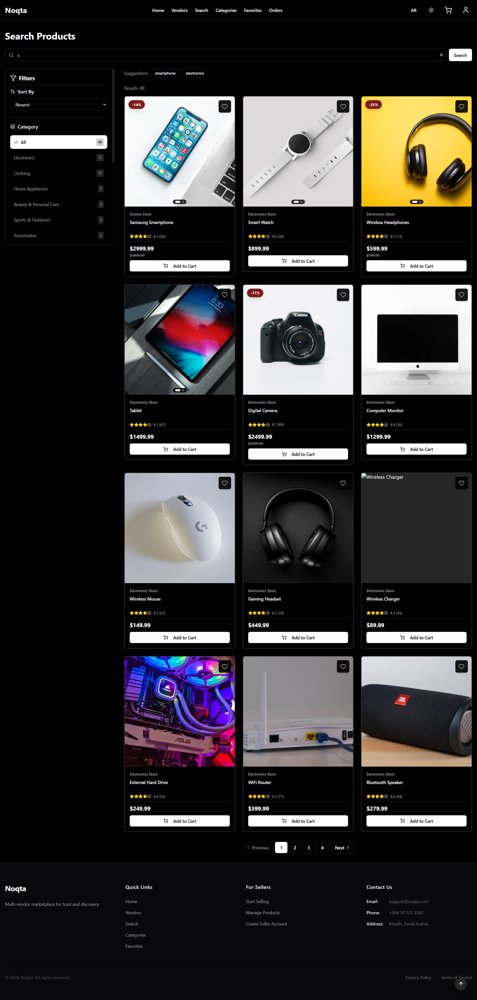<br>
      <em>Product search</em>
    </td>
    <td align="center" width="16.66%">
      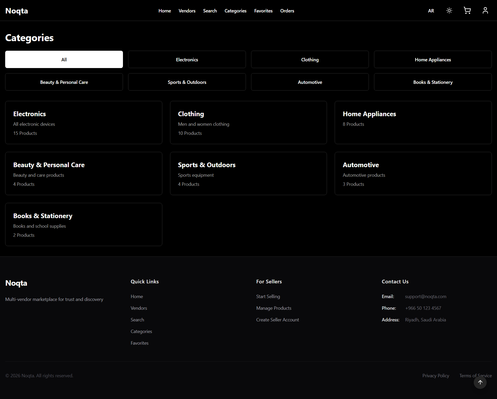<br>
      <em>Browse categories</em>
    </td>
    <td align="center" width="16.66%">
      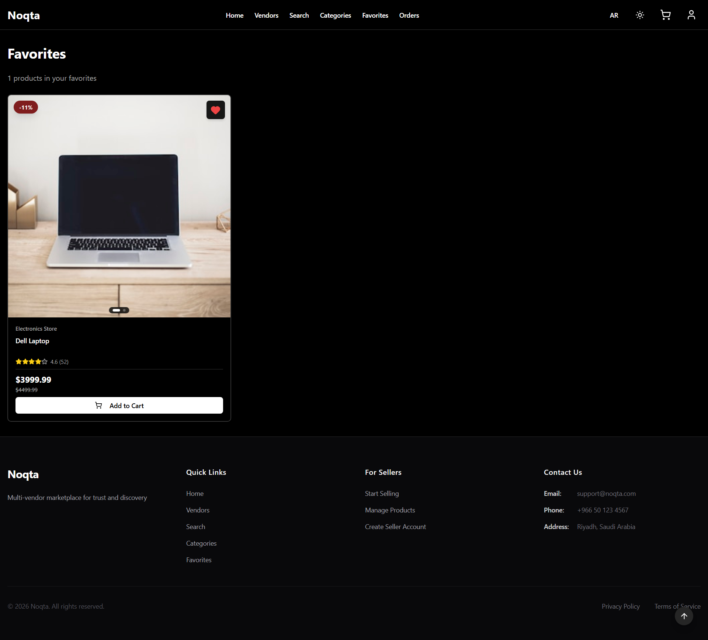<br>
      <em>Saved items</em>
    </td>
  </tr>

  <tr>
    <td align="center" width="16.66%">
      <strong>🔐 Login</strong>
    </td>
    <td align="center" width="16.66%">
      <strong>📝 Register</strong>
    </td>
    <td align="center" width="16.66%">
      <strong>🛒 Cart</strong>
    </td>
    <td align="center" width="16.66%">
      <strong>📦 Orders</strong>
    </td>
    <td align="center" width="16.66%">
      <strong>📄 Order Details</strong>
    </td>
    <td align="center" width="16.66%">
      <strong>📊 Dashboard</strong>
    </td>
  </tr>

  <tr>
    <td align="center" width="16.66%">
      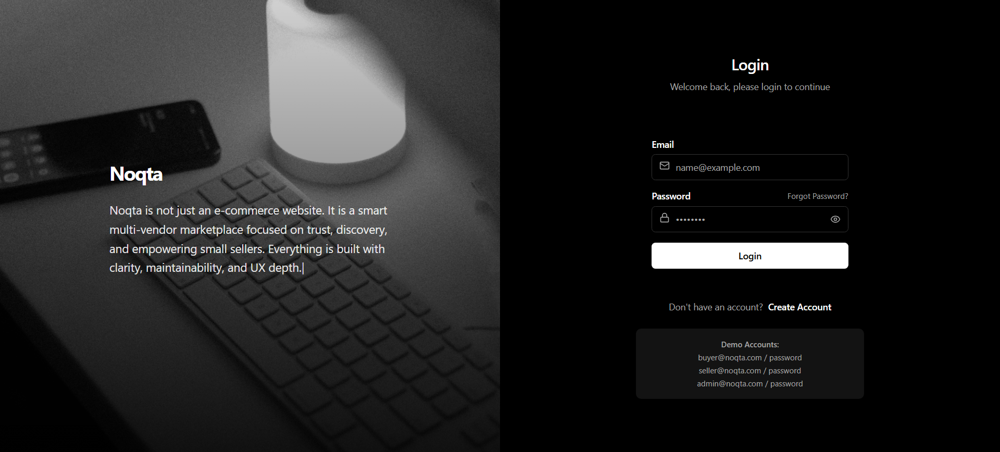<br>
      <em>User login</em>
    </td>
    <td align="center" width="16.66%">
      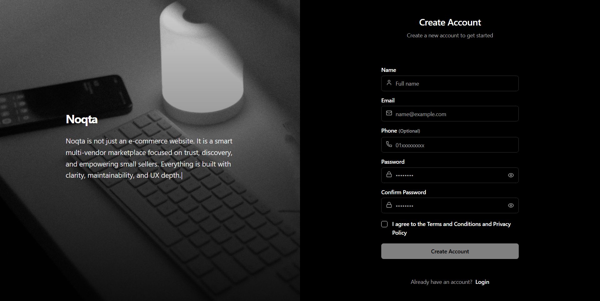<br>
      <em>New account</em>
    </td>
    <td align="center" width="16.66%">
      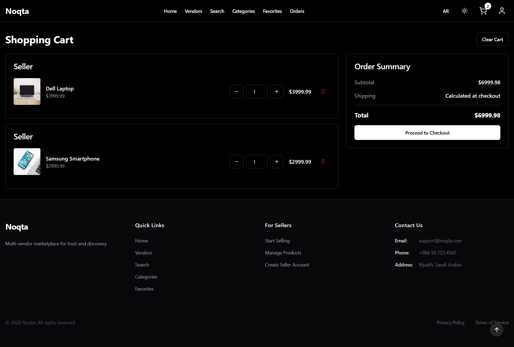<br>
      <em>Shopping cart</em>
    </td>
    <td align="center" width="16.66%">
      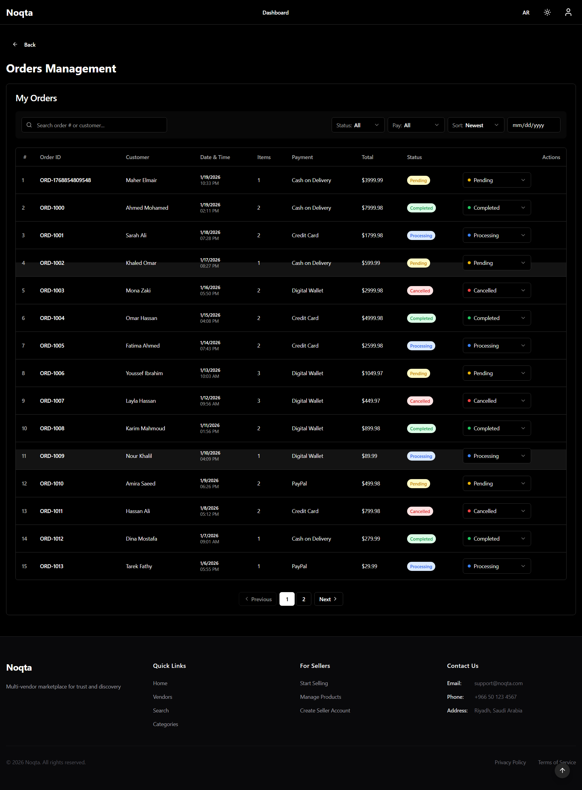<br>
      <em>Order management</em>
    </td>
    <td align="center" width="16.66%">
      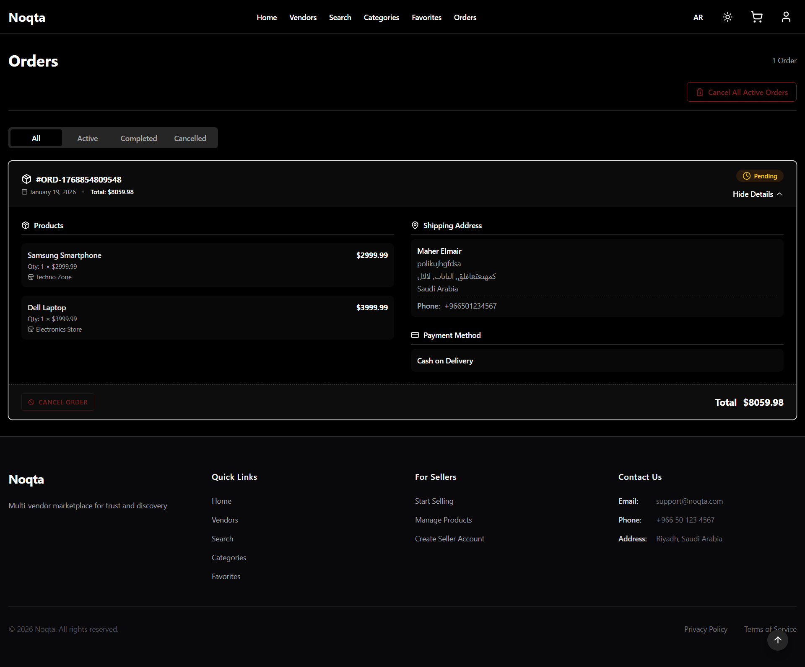<br>
      <em>Order details view</em>
    </td>
    <td align="center" width="16.66%">
      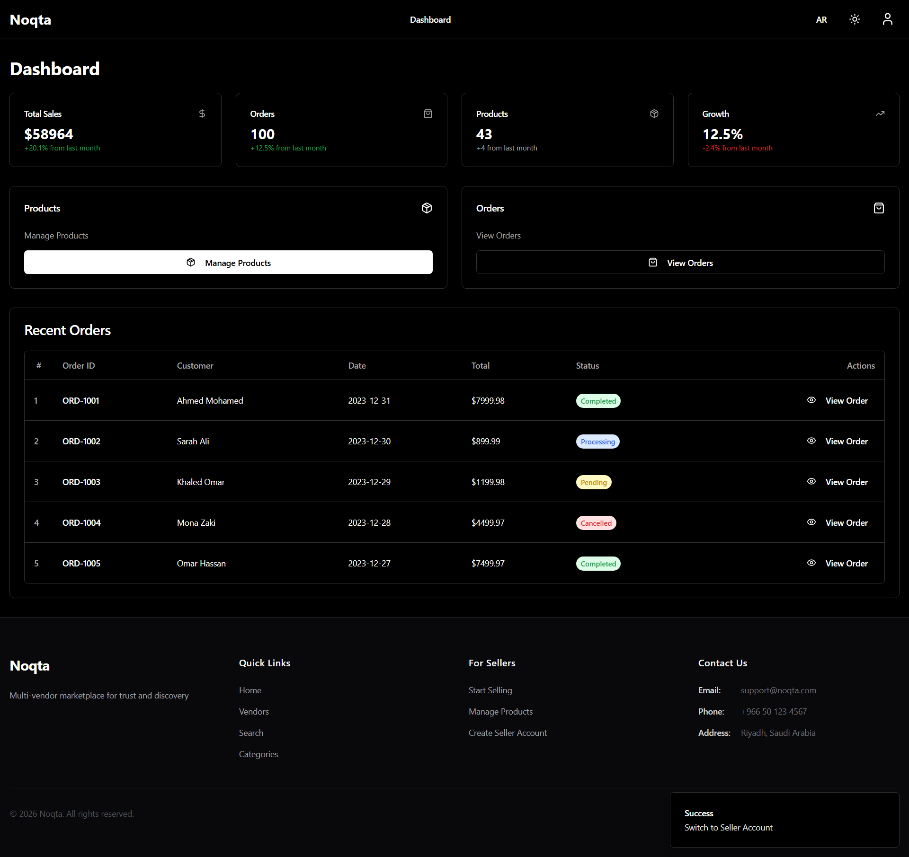<br>
      <em>Seller dashboard</em>
    </td>
  </tr>

  <tr>
    <td align="center" width="16.66%">
      <strong>🏬 Vendors</strong>
    </td>
    <td align="center" width="16.66%">
      <strong>📋 Products</strong>
    </td>
    <td align="center" width="16.66%">
      <strong>👥 Users</strong>
    </td>
    <td align="center" width="16.66%">
      <strong>👤 Portfolio</strong>
    </td>
    <td colspan="2" align="center" width="33.33%">
      <strong>🎯 Platform Features</strong>
    </td>
  </tr>

  <tr>
    <td align="center" width="16.66%">
      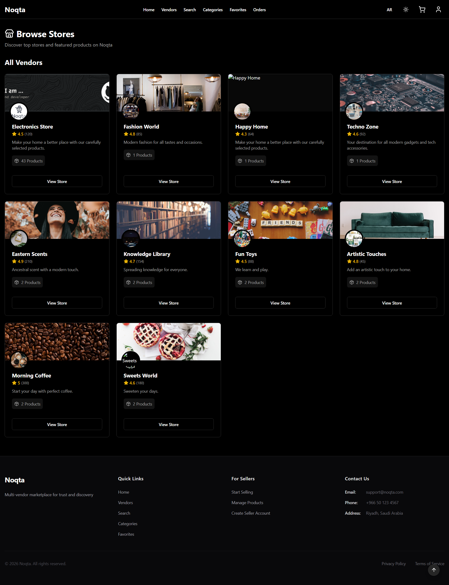<br>
      <em>Vendors list</em>
    </td>
    <td align="center" width="16.66%">
      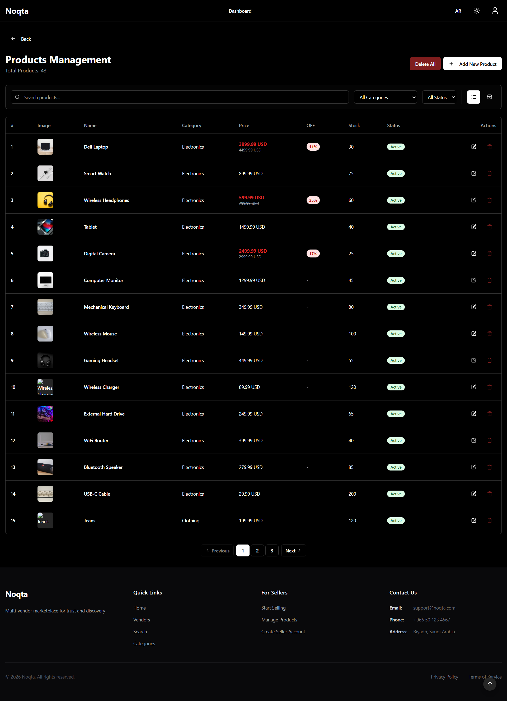<br>
      <em>Product management</em>
    </td>
    <td align="center" width="16.66%">
      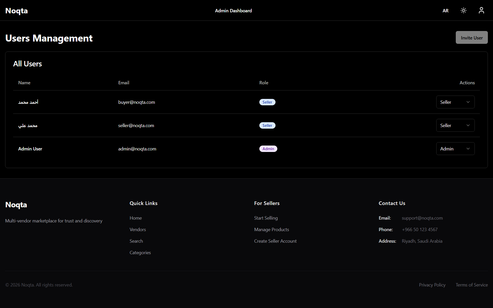<br>
      <em>User management</em>
    </td>
    <td align="center" width="16.66%">
      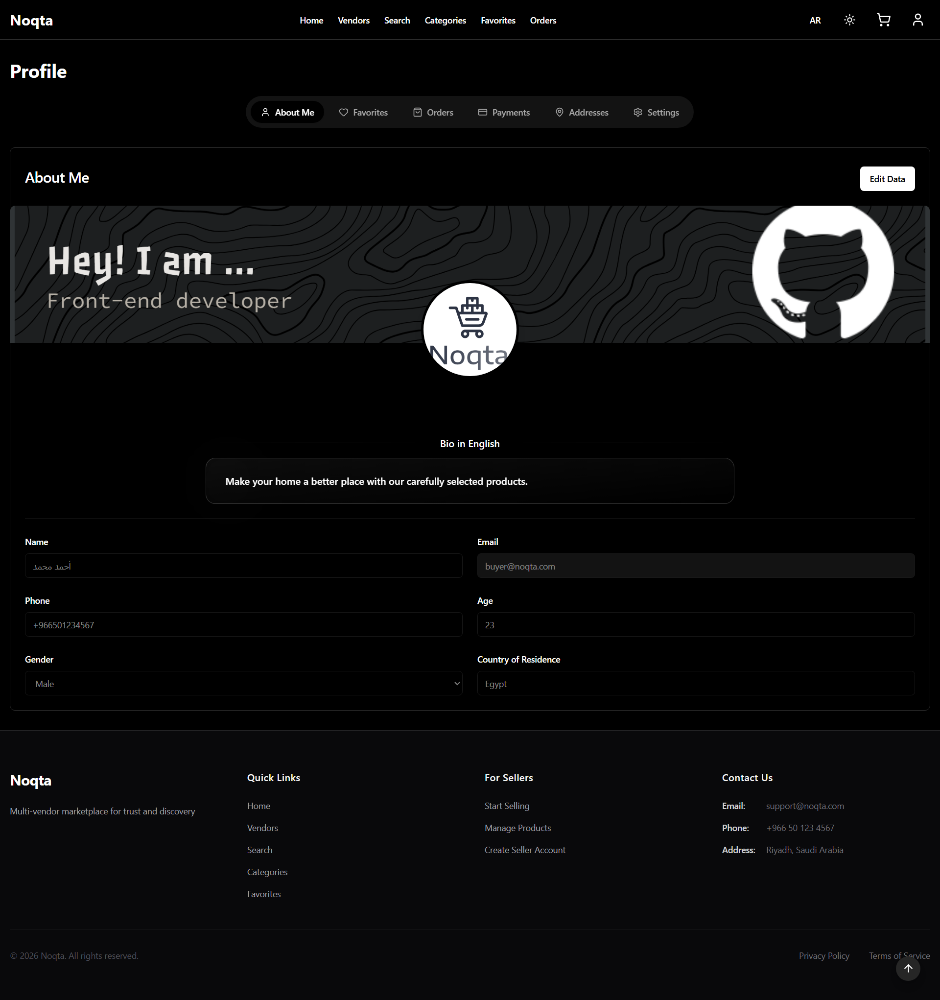<br>
      <em>User portfolio</em>
    </td>
    <td colspan="2" align="center" width="33.33%">
      <ul align="left" style="font-size: 0.9em;">
        <li>Multi-vendor marketplace</li>
        <li>Role-based dashboards</li>
        <li>Arabic/English support</li>
        <li>Dark/Light themes</li>
        <li>Advanced product search</li>
        <li>Order tracking system</li>
      </ul>
    </td>
  </tr>
</table>

---

## 🛠️ Tech Stack

| Category | Tools & Libraries |
|----------|-------------------|
| **Core Framework** | React 19.2.0, TypeScript 5.9.3, Vite 7.2.4 |
| **Styling** | Tailwind CSS 4.1.18, shadcn/ui, Radix UI Primitives |
| **State Management** | Zustand 5.0.9 (Client State), TanStack Query 5.90.12 (Server State) |
| **Routing** | React Router DOM 7.11.0 |
| **UI Components** | shadcn/ui, Radix UI, Lucide React Icons |
| **Internationalization** | i18next 24.0.0, react-i18next 15.0.0 |
| **Utilities** | date-fns 4.1.0, clsx, tailwind-merge, class-variance-authority |
| **Development** | ESLint 9.39.1, TypeScript ESLint |

---

## 📁 Project Structure

```md
src/
├── app/                    # Application entry point
├── components/
│   ├── checkout/           # Checkout related components
│   ├── common/             # Shared components (ProductCard, etc.)
│   ├── layouts/            # Page layouts (MainLayout)
│   ├── states/             # Empty/error/loading states
│   ├── ui/                 # shadcn/ui components
│   └── vendors/            # Vendor specific components
├── hooks/                  # Custom React hooks
├── i18n/                   # Internationalization files
├── lib/                    # Utilities and helpers
├── pages/                  # Page components
│   ├── auth/               # Login, Register
│   ├── buyer/              # Buyer pages
│   ├── seller/             # Seller dashboard
│   ├── admin/              # Admin panel
│   └── vendors/            # Vendors pages
├── services/               # API services
├── stores/                 # Zustand stores
├── style/                  # Style files
├── types/                  # TypeScript types
└── ...                     # Other files
```

---

## 🎯 Core Features

### 👥 Multi-Role System
| Role | Features |
|------|----------|
| **Guest** | Browse products, view details, search |
| **Buyer** | Cart management, favorites, order tracking, smart search |
| **Seller** | Product management, analytics dashboard, sales reports |
| **Admin** | Platform oversight, user management, category control |

### 🛒 Smart Shopping Experience
- **Seller-grouped cart** - Items organized by vendor
- **Smart search** - Intent-aware with typo correction
- **Recommendations** - Personalized product suggestions
- **Wishlist** - Persistent favorites storage

### 📊 Seller Empowerment
- **Dashboard analytics** - Sales insights and trends
- **Product management** - Full CRUD operations
- **Order processing** - Streamlined fulfillment workflow
- **Pricing tools** - Coupon and discount management

### 🌍 International & Accessibility
- **Bilingual support** - Arabic (RTL) & English (LTR)
- **Theme switching** - Light/Dark mode with system preference
- **Accessible components** - Built on Radix UI primitives
- **Responsive design** - Mobile-first approach

---

## 🔐 Authentication & Security

| Feature | Implementation |
|---------|----------------|
| **Role-based access** | Protected routes for each user type |
| **Persistent sessions** | LocalStorage with Zustand |
| **Test accounts** | Pre-configured buyer, seller, admin roles |
| **Secure routing** | React Router with auth guards |

### Test Accounts
- **Buyer**: `buyer@noqta.com` / `password`
- **Seller**: `seller@noqta.com` / `password`
- **Admin**: `admin@noqta.com` / `password`

---

## 🚀 Getting Started

### Prerequisites
- Node.js 18+
- npm or yarn

### Installation

```bash
# Clone the repository
git clone https://github.com/Maher-Elmair/Noqta-Marketplace.git
cd noqta

# Install dependencies
npm install

# Start development server
npm run dev

# Build for production
npm run build
```

---

## 🎨 Design System

| Feature | Description |
|---------|-------------|
| **Theme Support** | Light, Dark, and System preference |
| **RTL/LTR** | Full bidirectional text support |
| **Component Library** | shadcn/ui with Radix UI primitives |
| **Icons** | Lucide React icon set |
| **Animations** | Smooth transitions and micro-interactions |

---

## 📈 Project Roadmap

| Phase | Features |
|-------|----------|
| **Phase 1** | ✅ Core marketplace functionality<br>✅ Multi-role system<br>✅ Basic analytics |
| **Phase 2** | 🔄 Real backend integration<br>🔄 Payment gateway<br>🔄 Advanced recommendations |
| **Phase 3** | 📅 Real-time notifications<br>📅 Advanced analytics dashboard<br>📅 Mobile app (React Native) |
| **Future** | 🌟 PWA support<br>🌟 AI-powered insights<br>🌟 Social features |

---

## 👨‍💻 Developer

**Maher Elmair**

* 📫 [maher.elmair.dev@gmail.com](mailto:maher.elmair.dev@gmail.com)
* 🔗 [LinkedIn](https://www.linkedin.com/in/maher-elmair)
* ✖️ [X (Twitter)](https://x.com/Maher_Elmair)
* ❤️ Made with passion by [Maher Elmair](https://maher-elmair.github.io/My_Website)

<h2></h2>

### 🔗 Live Preview

🚀 **Try it now on Vercel:** 

* 🌍 [View Live Project](https://noqta-marketplace.vercel.app/)

<h2></h2>

### 🙌 Thank You  

If you like this project, please ⭐ the repository!  
Feel free to open issues or pull requests for improvements 🙏

<h2></h2>
  
<h6 align="center"><i>Noqta - Where trusted commerce meets community</i></h6>